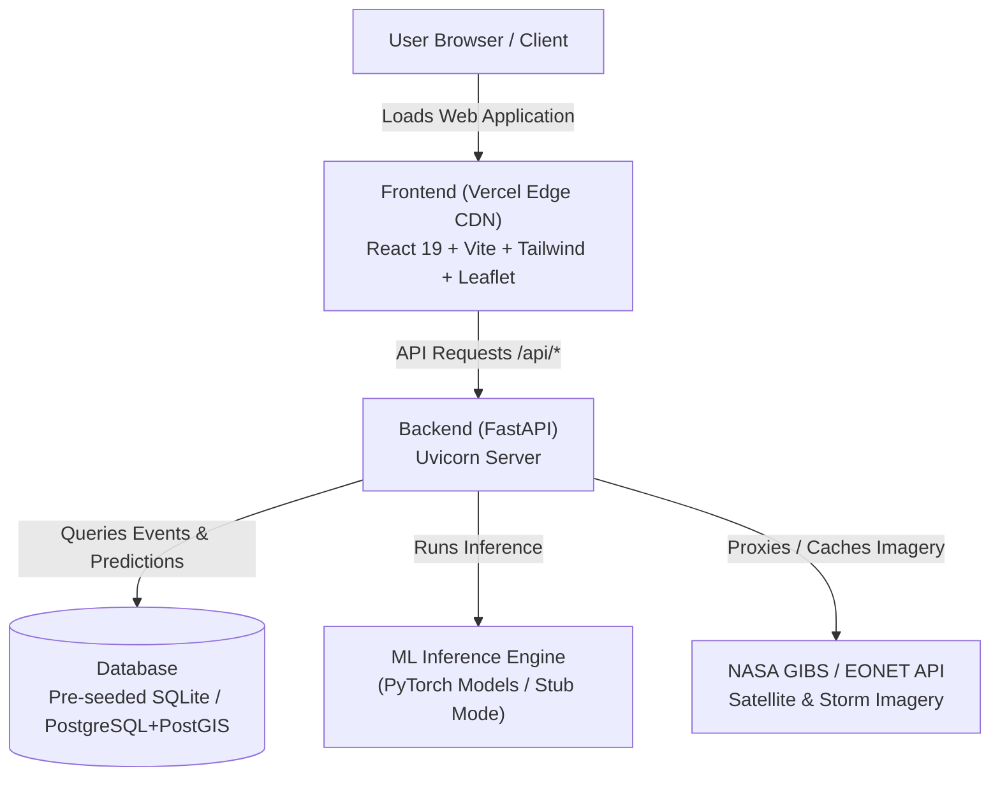

# 🌪️ CycloNet — Complete Execution & Deployment Guide

> **Smart India Hackathon 2026 (PS70)**  
> *AI/ML-based Tropical Cyclone Identification, Structural Classification, and Prediction System.*

---

## 📑 Table of Contents

1. [System Architecture Overview](#-system-architecture-overview)
2. [Prerequisites](#-prerequisites)
3. [Part 1: Running the Project Locally](#-part-1-running-the-project-locally)
   - [Method A: Quickstart with SQLite (Fastest, Zero Docker)](#method-a-quickstart-with-sqlite-recommended-for-testing)
   - [Method B: Full Stack with Docker Compose (PostgreSQL + PostGIS)](#method-b-full-stack-with-docker-compose-production-simulation)
4. [Part 2: Deploying to Vercel & Cloud](#-part-2-deploying-to-vercel--cloud)
   - [Understanding the Deployment Architecture](#understanding-the-deployment-architecture)
   - [Step 1: Deploy Backend (Render / Railway / Cloud VM)](#step-1-deploy-the-fastapi-backend)
   - [Step 2: Deploy Frontend on Vercel (Web Dashboard)](#step-2-deploy-the-frontend-on-vercel)
   - [Step 3: Alternative CLI Deployment (`vercel` CLI)](#step-3-deploy-via-vercel-cli)
   - [Step 4: Zero-CORS API Proxy with Vercel Rewrites](#step-4-zero-cors-setup-using-vercel-rewrites)
   - [Step 5: Monorepo Setup (Root `vercel.json`)](#step-5-monorepo-deployments-root-verceljson)
5. [Environment Variables Reference](#-environment-variables-reference)
6. [Testing & Verification Checklist](#-testing--verification-checklist)
7. [Troubleshooting & FAQs](#-troubleshooting--faqs)

---

## 🏛️ System Architecture Overview



CycloNet consists of two primary services:
- **Frontend (`/frontend`)**: A modern React 19 + TypeScript + Vite SPA equipped with Leaflet satellite mapping, NASA GIBS real-time tiles, Framer Motion animations, and Zustand state management.
- **Backend (`/backend`)**: A high-performance FastAPI service with spatial query support, historical storm replay databases, automated intensity estimation, YOLO pattern scanning, and machine learning adapters.

---

## 🧰 Prerequisites

Ensure the following tools are installed on your machine:

| Tool | Recommended Version | Download Link |
|---|---|---|
| **Node.js** | `v18.x` or `v20.x+` (LTS) | [nodejs.org](https://nodejs.org/) |
| **Python** | `3.10.x`, `3.11.x`, or `3.12.x` | [python.org](https://www.python.org/) |
| **Git** | `2.x+` | [git-scm.com](https://git-scm.com/) |
| **Docker Desktop** *(Optional for Method B)* | Latest | [docker.com](https://www.docker.com/) |

---

## 💻 Part 1: Running the Project Locally

### Method A: Quickstart with SQLite (Recommended for Testing)

This method requires **no Docker** and runs directly using Python and Node.js. The repository comes with a pre-seeded SQLite database (`backend/cyclonewatch.db`) containing 7 historical cyclones (Biparjoy, Amphan, Fani, Tauktae, Phailin, Hudhud, Ockhi).

#### Step 1: Clone the Repository
```bash
git clone https://github.com/imroshanyadav/CycloneNet.git
cd CycloneNet
```

#### Step 2: Set Up and Start the Backend

1. Navigate to the `backend` folder:
   ```bash
   cd backend
   ```

2. Create a virtual environment:
   - **Windows (PowerShell / CMD):**
     ```powershell
     python -m venv venv
     .\venv\Scripts\activate
     ```
   - **macOS / Linux:**
     ```bash
     python3 -m venv venv
     source venv/bin/activate
     ```

3. Install required Python packages:
   ```bash
   pip install --upgrade pip
   pip install -r requirements.txt
   ```
   *(Note: On Windows without a GPU, standard CPU wheels will automatically be used.)*

4. Verify or create your `backend/.env` file:
   Create or verify `backend/.env`:
   ```env
   DATABASE_URL=sqlite+aiosqlite:///./cyclonewatch.db
   DATABASE_SYNC_URL=sqlite:///./cyclonewatch.db
   ML_FORCE_STUB=true
   DEBUG=true
   API_VERSION=v1
   CORS_ORIGINS=*
   ```

5. Start the FastAPI backend:
   ```bash
   python -m uvicorn app.main:app --host 127.0.0.1 --port 8000 --reload
   ```
   *Alternative minimal runner:*
   ```bash
   python run_simple.py
   ```

6. Confirm the backend is live:
   - **Health check:** Open `http://localhost:8000/health` (should return `{"status":"ok","db":"ok"}`)
   - **Interactive API Docs (Swagger):** Open `http://localhost:8000/docs`

---

#### Step 3: Set Up and Start the Frontend

Open a **new terminal window** in the project root:

1. Navigate to the `frontend` folder:
   ```bash
   cd frontend
   ```

2. Install dependencies:
   ```bash
   npm install
   ```

3. *(Optional)* Configure environment variables:
   Create a `frontend/.env.local` file:
   ```env
   # Leave as /api so Vite reverse-proxies directly to port 8000
   VITE_API_BASE_URL=/api
   ```

4. Start the Vite development server:
   ```bash
   npm run dev
   ```

5. Open your browser:
   Navigate to **`http://localhost:5173`**.

---

### Method B: Full Stack with Docker Compose (Production Simulation)

Use this method if you want to test the full enterprise architecture with PostgreSQL 15 and PostGIS 3.3.

1. Ensure **Docker Desktop** is open and running.
2. In the `backend` directory, create your environment file:
   ```bash
   cd backend
   cp .env.example .env
   ```
3. Start the containers:
   ```bash
   docker compose up --build
   ```
4. Run migrations and database seeding (in another terminal):
   ```bash
   docker compose exec api alembic upgrade head
   docker compose exec api python -m scripts.seed_db
   ```
5. In another terminal, start the frontend as described in [Step 3](#step-3-set-up-and-start-the-frontend).

---

## 🚀 Part 2: Deploying to Vercel & Cloud

### Understanding the Deployment Architecture

> [!IMPORTANT]
> **Why decouple Frontend on Vercel and Backend on Render/Railway?**  
> Vercel is optimized for frontend applications and serverless edge functions. However, CycloNet's backend includes heavy machine learning frameworks (`torch`), geospatial C-libraries (`rasterio`, `shapely`, `geoalchemy2`), and persistent databases that exceed Vercel's **250MB serverless bundle limit** and request timeout limits.  
> 
> Therefore, the **industry-standard best practice** is:
> 1. **Deploy Frontend on Vercel** (Global CDN, fast builds, custom domains).
> 2. **Deploy Backend on Render / Railway / Fly.io / AWS EC2** (Full Docker/Python runtime support).

---

### Step 1: Deploy the FastAPI Backend

You can deploy the backend for free on **[Render](https://render.com/)**, **[Railway](https://railway.app/)**, or **[Koyeb](https://www.koyeb.com/)**. Here are the steps for Render:

1. Push your repository to **GitHub**.
2. Log in to [Render Dashboard](https://dashboard.render.com/) and click **New +** > **Web Service**.
3. Connect your GitHub repository.
4. Configure the Web Service:
   - **Name:** `cyclonet-api`
   - **Root Directory:** `backend`
   - **Environment:** `Python 3` (or choose `Docker` if using `backend/Dockerfile`)
   - **Build Command:**
     ```bash
     pip install -r requirements.txt
     ```
   - **Start Command:**
     ```bash
     uvicorn app.main:app --host 0.0.0.0 --port $PORT
     ```
5. Add the **Environment Variables** in Render's dashboard:
   | Key | Value | Note |
   |---|---|---|
   | `DATABASE_URL` | `sqlite+aiosqlite:///./cyclonewatch.db` | Or your managed PostgreSQL connection string |
   | `DATABASE_SYNC_URL` | `sqlite:///./cyclonewatch.db` | Synchronous DB URL |
   | `ML_FORCE_STUB` | `true` | Enables lightweight, rapid inference |
   | `DEBUG` | `false` | Production mode |
   | `CORS_ORIGINS` | `*` | Or specify your Vercel URL once deployed |
6. Click **Deploy Web Service**.
7. Once deployed, copy your backend URL (e.g., `https://cyclonet-api.onrender.com`).
8. Verify in your browser: `https://cyclonet-api.onrender.com/health` should return `{"status":"ok","db":"ok"}`.

---

### Step 2: Deploy the Frontend on Vercel

1. Log in to your [Vercel Dashboard](https://vercel.com/dashboard).
2. Click **Add New...** > **Project**.
3. Select and import your `CycloneNet` repository.
4. In the **Configure Project** screen, configure the following settings:
   - **Project Name:** `cyclonet-dashboard` (or your preferred name)
   - **Framework Preset:** `Vite`
   - **Root Directory:** Click *Edit* and select **`frontend`** (Click *Continue*)
   - **Build & Development Settings:**
     - **Build Command:** `npm run build` (Default)
     - **Output Directory:** `dist` (Default)
     - **Install Command:** `npm install` (Default)
5. Expand **Environment Variables**:
   Add the backend connection variable:
   - **Key:** `VITE_API_BASE_URL`
   - **Value:** `https://cyclonet-api.onrender.com/api` *(replace with your actual Render/Railway backend URL without a trailing slash)*
6. Click **Deploy**.
7. In ~30 seconds, Vercel will build and assign you a live production URL (e.g., `https://cyclonet-dashboard.vercel.app`).

---

### Step 3: Deploy via Vercel CLI

If you prefer deploying directly from your local terminal:

1. Install the Vercel CLI globally:
   ```bash
   npm install -g vercel
   ```
2. Navigate to the `frontend` folder:
   ```bash
   cd frontend
   ```
3. Log in to Vercel:
   ```bash
   vercel login
   ```
4. Deploy to preview:
   ```bash
   vercel
   ```
5. Deploy to production with environment variables:
   ```bash
   vercel --prod --build-env VITE_API_BASE_URL="https://cyclonet-api.onrender.com/api"
   ```

---

### Step 4: Zero-CORS Setup using Vercel Rewrites

To avoid all CORS issues and domain mismatches, you can proxy all `/api/*` traffic through Vercel's edge network directly to your cloud backend.

Update `frontend/vercel.json`:
```json
{
  "$schema": "https://openapi.vercel.sh/vercel.json",
  "rewrites": [
    {
      "source": "/api/:path*",
      "destination": "https://cyclonet-api.onrender.com/api/:path*"
    },
    {
      "source": "/(.*)",
      "destination": "/index.html"
    }
  ]
}
```

With this rewrite rule in place:
- The frontend code can call `/api/...` directly.
- The browser treats both frontend and backend as the same domain.
- No CORS configuration headers are required.

---

### Step 5: Monorepo Deployments (Root `vercel.json`)

If deploying from the repository root rather than setting the Root Directory to `frontend`, the repository includes a root `vercel.json`:

```json
{
  "$schema": "https://openapi.vercel.sh/vercel.json",
  "services": {
    "backend": {
      "root": "backend",
      "framework": "fastapi",
      "entrypoint": "app.main:app"
    },
    "frontend": {
      "root": "frontend",
      "framework": "vite"
    }
  },
  "rewrites": [
    {
      "source": "/api/(.*)",
      "destination": {
        "service": "backend"
      }
    },
    {
      "source": "/(.*)",
      "destination": {
        "service": "frontend"
      }
    }
  ]
}
```

> [!NOTE]
> Vercel multi-service routing is supported on Vercel CLI and enterprise monorepo configurations. For standard hobby/free tier accounts, **Step 1 & Step 2 (Decoupled deployment)** is the most dependable and widely supported deployment path.

---

## ⚙️ Environment Variables Reference

### Backend (`backend/.env`)

| Variable | Type | Default | Description |
|---|---|---|---|
| `DATABASE_URL` | String | `sqlite+aiosqlite:///./cyclonewatch.db` | Async database URL (`asyncpg` for PostgreSQL, `aiosqlite` for SQLite) |
| `DATABASE_SYNC_URL` | String | `sqlite:///./cyclonewatch.db` | Synchronous database URL (used by Alembic and seeding scripts) |
| `ML_FORCE_STUB` | Boolean | `true` | If `true`, uses lightweight deterministic ML stub; set to `false` when running full deep learning weights |
| `DEBUG` | Boolean | `true` | Toggles detailed query logging and debug traces |
| `API_VERSION` | String | `v1` | API version metadata |
| `CORS_ORIGINS` | String | `*` | Comma-separated list of allowed origins (e.g. `https://your-app.vercel.app,http://localhost:5173`) |
| `DATA_ROOT` | String | `/data` | Satellite imagery storage directory |
| `DEMO_DATA_ROOT` | String | `/data/demo` | Seeded demo assets path |
| `ML_PACKAGE_PATH` | String | `/ml` | Path to machine learning package directory |

### Frontend (`frontend/.env.local` / Vercel Environment Variables)

| Variable | Type | Default | Description |
|---|---|---|---|
| `VITE_API_BASE_URL` | String | `/api` | Root endpoint of the backend API (without trailing slash). In development, Vite proxies this to `http://127.0.0.1:8000`. In production, set to your backend URL e.g. `https://cyclonet-api.onrender.com/api` |

---

## 🧪 Testing & Verification Checklist

After starting locally or deploying to Vercel, verify all features:

- [ ] **1. Landing Page:** Navigate to your frontend URL. The opening dashboard and intro animation should appear.
- [ ] **2. Historical Replay:** Switch between storms in the cyclone selector dropdown:
  - Cyclone Biparjoy (2023)
  - Cyclone Amphan (2020)
  - Cyclone Fani (2019)
- [ ] **3. Timeline Slider:** Drag the timeline scrubber at the bottom; track points, storm coordinates, and intensity category should update dynamically.
- [ ] **4. Map Layers:**
  - High-resolution Esri satellite base layer loads.
  - NASA GIBS MODIS True Color cloud imagery overlay loads and aligns with the cyclone date.
- [ ] **5. Intensity Estimation Modal:**
  - Click the **"ESTIMATE INTENSITY"** button in the lower right.
  - Drag and drop or upload a satellite image (PNG/JPEG/TIFF).
  - Click **"ESTIMATE INTENSITY"**; results should return wind speed (knots, km/h), IMD category, damage assessment, and model confidence score.
- [ ] **6. YOLO Scanner & NASA Events:**
  - Click **"YOLO SCANNER"** to run automated storm boundary and center detection on North Indian Ocean tiles.
  - Open **"NASA STORMS"** to load active global cyclone events from NASA EONET.
- [ ] **7. Backend Health Endpoint:** `GET /health` returns `200 OK` with `{"status":"ok","db":"ok"}`.
- [ ] **8. OpenAPI Swagger Documentation:** Open `/docs` to test endpoints interactively.

---

## 🛠️ Troubleshooting & FAQs

### 1. Port 8000 or 5173 Already in Use
**Problem:** `[Errno 10048] error while attempting to bind on address ('0.0.0.0', 8000)`  
**Solution:**
- On Windows (PowerShell):
  ```powershell
  Get-Process -Id (Get-NetTCPConnection -LocalPort 8000).OwningProcess | Stop-Process -Force
  ```
- Or run backend on a different port:
  ```powershell
  python -m uvicorn app.main:app --port 8001 --reload
  ```
  *(Update `frontend/vite.config.ts` target or `.env.local` to match the new port).*

### 2. Frontend Shows "Failed to Fetch" or Network Error
**Problem:** The browser cannot connect to the backend API.  
**Solutions:**
- **Local:** Check if the backend terminal is running and listening on port 8000. Test `http://localhost:8000/health` directly in your browser.
- **Production (Vercel):** Check that `VITE_API_BASE_URL` in Vercel's Environment Variables points to your live backend URL (e.g., `https://cyclonet-api.onrender.com/api`).
- **CORS:** Ensure `CORS_ORIGINS` in your backend environment variables includes your Vercel domain or is set to `*`.

### 3. Vercel Single-Page Application Refresh Error (404 Not Found)
**Problem:** Refreshing the browser on a nested route produces a Vercel 404 error.  
**Solution:** The provided `frontend/vercel.json` contains:
```json
{
  "rewrites": [{ "source": "/(.*)", "destination": "/index.html" }]
}
```
This automatically directs all client routing through `index.html`.

### 4. Missing Dependencies or "ModuleNotFoundError: No module named 'PIL'"
**Problem:** `ModuleNotFoundError: No module named 'PIL'` or `fastapi` during local setup or Docker deployment.  
**Solution:**
- The `Pillow` package provides the `PIL` module (used for satellite image processing and NASA overlays). Ensure `Pillow>=10.0.0` is present in `requirements.txt` (this has been updated in the repository).
- In a local environment:
  ```bash
  pip install -r requirements.txt
  # or specifically:
  pip install Pillow
  ```
- If deploying on Render/Railway: Git commit and push the updated `backend/requirements.txt` and `backend/Dockerfile` to trigger an automatic successful redeploy.

### 5. Backend Database Locked or Table Missing
**Problem:** `sqlite3.OperationalError: no such table: events`  
**Solution:**
The repository includes a ready-to-use SQLite database at `backend/cyclonewatch.db`. If you ever need to recreate it from scratch:
```bash
cd backend
python -m scripts.seed_db --reset
```

---

## 👨‍💻 Support & Contacts

For any questions, improvements, or hackathon evaluation requests, consult:
- **Project Explainer:** [PROJECT_EXPLAINER.md](PROJECT_EXPLAINER.md)
- **Model Integration Guide:** [backend/ML_MODEL_INTEGRATION.md](backend/ML_MODEL_INTEGRATION.md)
- **Frontend Architecture:** [frontend/README.md](frontend/README.md)
- **Backend Architecture:** [backend/README.md](backend/README.md)
